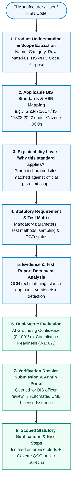

<div align="center">

# 🏛️ BIS 
### *AI-Powered Bureau of Indian Standards Compliance Navigator & Verification Gateway*

[](https://sih.gov.in/)
[](https://consumeraffairs.nic.in/)
[](https://bis.gov.in/)

<br/>

[](https://fastapi.tiangolo.com/)
[](https://react.dev/)
[](https://vitejs.dev/)
[](https://tailwindcss.com/)
[](https://www.trychroma.com/)
[](https://ai.google.dev/)
[](https://build.nvidia.com/)
[](https://bhashini.gov.in/)
[](LICENSE)

<br/>

> **Platform Paradigm:**  
> **Product / HSN Code** &rarr; **Applicable BIS Standard** &rarr; **Statutory Rationale** &rarr; **Requirement Matrix** &rarr; **Evidence Audit** &rarr; **Compliance Readiness** &rarr; **Verification & Licensing**

</div>

---

> [!IMPORTANT]
> **🚀 Current Deployment Status:**
> **As of now, the frontend UI has been deployed.** The deployed frontend features the complete user interface, interactive Standards Catalog, dual HSN/IS Standards Comparator, full-page Bhashini translation engine, and UI mock/preview workflows. The full backend (FastAPI RAG pipeline, ChromaDB vector store, SQLite registry, and Express JWT bridge) can be run locally using the [Quick Start Guide](#-quick-start-guide) below.

---

## 📑 Table of Contents

- [🏛️ Executive Summary & Product Vision](#️-executive-summary--product-vision)
- [🔄 End-to-End Compliance Pipeline](#-end-to-end-compliance-pipeline)
- [🌟 Core V2 Capabilities](#-core-v2-capabilities)
  - [1. Product &rarr; Standard Discovery](#1-product--applicable-standard-discovery-p0)
  - [2. "Why This Standard Applies?" Explainability](#2-why-does-this-standard-apply-explainability)
  - [3. Evidence-First RAG & Claim-Level Citations](#3-evidence-first-rag--claim-level-citations)
  - [4. Dual HSN Code & IS Standards Comparator](#4-dual-hsn-code--is-standards-comparator)
  - [5. Compliance Readiness Engine vs. AI Confidence](#5-compliance-readiness-engine-vs-ai-confidence)
  - [6. Document & Test Report Analyzer with Relevance Guard](#6-document--test-report-analyzer-with-relevance-guard)
  - [7. Authentic ISI Mark & CML License Verifier](#7-authentic-isi-mark--cml-license-verifier)
  - [8. Dedicated BIS Officer Admin Control Panel (`/admin`)](#8-dedicated-bis-officer-admin-control-panel-admin)
  - [9. Scoped Statutory & Enterprise Notification Center](#9-scoped-statutory--enterprise-notification-center)
  - [10. Ephemeral In-Memory Authentication & Feature Gating](#10-ephemeral-in-memory-authentication--strict-feature-gating)
  - [11. Bhashini Dynamic Full-Page Translation & Voice Input](#11-bhashini-dynamic-full-page-translation--voice-input)
- [🏗️ System Architecture](#️-system-architecture)
- [⚡ Quick Start Guide](#-quick-start-guide)
- [🎬 Demo Walkthrough (SIH 2026 Flow)](#-demo-walkthrough-sih-2026-flow)
- [🔒 Security, Data Privacy & Guardrails](#-security--guardrails)
- [📊 Currently Implemented vs. Future Roadmap](#-currently-implemented-vs-future-roadmap)

---

## 🏛️ Executive Summary & Product Vision

India publishes over **22,000+ Bureau of Indian Standards (BIS)** specifications enforced through hundreds of statutory **Quality Control Orders (QCOs)**. For Indian MSMEs, startups, and manufacturers, identifying which standards apply to their product, interpreting dense legal gazettes, and preparing audit-ready lab test reports involves severe administrative friction and costly compliance consultants.

**BIS Sahayak V2** solves this challenge by functioning not as a generic conversational bot, but as an **intelligent, government-grade compliance decision-support system and verification gateway**:

- 🎯 **Pinpoints Statutory Standards:** Maps natural language product descriptions or Harmonized System (HSN/ITC) codes directly to mandatory IS standards.
- 📜 **Explains Legal Scope:** Provides statutory grounding detailing *why* an order applies based on product characteristics, materials, and gazette schedules.
- 🧪 **Audits Test Documentation:** Analyzes lab reports and raw material certificates against mandatory clause parameters, flagging missing evidence and cross-product mismatches.
- ⚖️ **Dual-Metric Evaluation:** Decouples AI semantic retrieval confidence from actual physical compliance readiness.
- 🏛️ **Official Verification Gateway:** Links enterprise manufacturers with BIS certifying officers for direct dossier submission, review, and automated CM/L license generation.

---

## 🔄 End-to-End Compliance Pipeline



---

## 🌟 Core V2 Capabilities

### 1. Product &rarr; Applicable Standard Discovery (P0)
- Describe any product in natural language (e.g. *"I manufacture domestic pressure cookers"* or *"Stainless steel vacuum insulated water bottles"*).
- Automatically parses material compositions (SS 304, food-grade silicone), intended use, and product taxonomy.
- Surfaces relevant Indian Standards (IS) with relevance tiers (`High`, `Medium`), gazette enforcement dates, and active amendments.

### 2. "Why Does This Standard Apply?" Explainability
- Provides immediate statutory transparency instead of black-box classifications.
- Correlates specific physical product attributes directly to official gazette definitions, Quality Control Orders (QCOs), and Ministry notifications.

### 3. Evidence-First RAG & Claim-Level Citations
- **Zero-Hallucination Policy:** Every technical assertion, test threshold, or statutory parameter is anchored in verified BIS documentation.
- Every claim includes a clickable inline citation `[Source: IS XXXX:YYYY, Clause X.X, Page X]`.
- **Integrated Evidence Viewer Modal:** Allows clicking any citation to inspect the verbatim extracted clause text, test procedures, and source document page.

### 4. Dual HSN Code & IS Standards Comparator
- Cross-references Harmonized Tariff Numbers (HSN / ITC-HS codes) with Bureau of Indian Standards (IS).
- Compares chapter headings, subheadings, mandatory QCO schedules, and clause-by-clause diffs.
- Supports side-by-side comparative analysis of tariff classifications and technical standards.

### 5. Compliance Readiness Engine vs. AI Confidence
- **AI Grounding Confidence Score (0–100%):** Measures retrieval fidelity and semantic similarity against indexed official standards.
- **Compliance Readiness Score (0–100%):** Evaluates applicant test documentation against mandatory testing clauses.
- **Structured Requirement Matrix:** Categorizes every clause into clear audit statuses:
  - 🟢 `Complete` (Verified by uploaded test report)
  - 🟡 `Needs Review` (Inconclusive or partial test evidence)
  - 🔴 `Missing` (Mandatory clause with no submitted test report)
  - ⚪ `Not Applicable` (Exempt based on product configuration)

### 6. Document & Test Report Analyzer with Relevance Guard
- Ingests test certificates, raw material declarations, and NABL accredited lab reports (`.pdf`, `.txt`, `.docx`).
- Automated prompt-injection protection and sanitization on ingested files.
- **Relevance & Safety Guard:** Proactively detects cross-product mismatches (e.g. submitting a footwear test certificate for an aluminium pressure cooker) and notifies the applicant before evaluation.

### 7. Authentic ISI Mark & CML License Verifier
- Validates 7-digit `CM/L-XXXXXXX` certification marks against the National BIS License Registry.
- Provides transparent, authentic verifications (*"Licence information found"*, *"Unable to verify in registry"*).

### 8. Dedicated BIS Officer Admin Control Panel (`/admin`)
- Complete administrative control room for Bureau of Indian Standards officials with role-based routing:
  - `/admin/dashboard`: Real-time compliance metrics, queue volume, and application KPIs.
  - `/admin/verification`: Dossier review queue with clause evidence inspector, approval, and deficiency rejection notes.
  - `/admin/users`: Enterprise manufacturer directory and GSTIN/MSME status.
  - `/admin/reports`: Citizen grievance surveillance and market non-compliance investigations.
  - `/admin/activity`: Tamper-evident statutory audit trail.
  - `/admin/settings`: QCO enforcement modes and threshold parameters.
- **Automated CML Issuance:** Approving a verified dossier instantly generates an authentic CM/L license recorded in the registry.

### 9. Scoped Statutory & Enterprise Notification Center
- **Strict Data Isolation:** Registered enterprises only receive notifications for their own applications, deficiencies, and licence grants.
- **Public Gazette Bulletins:** Unauthenticated visitors and manufacturers see official QCO orders, standard amendments, and NABL laboratory notices without exposing private applicant data.

### 10. Ephemeral In-Memory Authentication & Strict Feature Gating
- Protected tabs (`compliance`, `documents`, `verification`, `admin`) require an active session and cannot be accessed as logged-in without authenticating.
- Pure in-memory session model guarantees that refreshing or reloading the browser resets the session cleanly, matching the privacy and freshness model of the AI chat assistant.

### 11. Bhashini Dynamic Full-Page Translation & Voice Input
- Real-time dynamic full-page translation engine supporting **22 Indian scheduled languages** across all DOM elements via Bhashini AI.
- Multi-lingual Web Speech API supporting Hindi and English voice input while preserving technical nomenclature (`IS 2347`, `CM/L`, `Clause`).

---

## 🏗️ System Architecture

```
bis-sahayak/
├── backend/
│   ├── app/
│   │   ├── main.py                     # FastAPI entry point, CORS & lifecycle
│   │   ├── config.py                   # Pydantic BaseSettings & multi-provider LLM config
│   │   ├── routes/
│   │   │   ├── navigator.py            # Product-to-Standard, Scoped Notifications & Submissions
│   │   │   ├── chat.py                 # Grounded chat & SSE streaming
│   │   │   ├── verify.py               # ISI Mark / CML license verifier
│   │   │   ├── export.py               # ReportLab compliance PDF export
│   │   │   ├── voice.py                # Audio & voice query handler
│   │   │   └── auth.py                 # JWT authentication & admin demo login
│   │   ├── services/
│   │   │   ├── product_matcher.py      # Product understanding & standard mapping engine
│   │   │   ├── compliance_engine.py    # Requirement matrix & readiness evaluator
│   │   │   ├── document_analyzer.py    # Test report OCR/text matcher & relevance guard
│   │   │   ├── standard_comparator.py  # Dual HSN / IS standard comparator
│   │   │   ├── hsn_catalog.py          # HSN code knowledge catalog
│   │   │   ├── retriever.py            # Hybrid dense vector + BM25 token retriever
│   │   │   ├── generator.py            # Grounded synthesizer (Gemini Flash + NVIDIA NIM fallback)
│   │   │   ├── confidence.py           # Multi-factor confidence calculator
│   │   │   └── audit.py                # SQLite query & audit logging
│   │   └── models/
│   │       ├── database.py             # SQLite schema, seeded licenses, submissions & notifs
│   │       └── schemas.py              # Pydantic validation schemas
│   ├── src/                            # Express / Node.js Microservices Bridge
│   │   ├── controllers/                # Chat, Document, and RAG controllers
│   │   ├── routes/                     # Submissions, Notifications, and Voice routes
│   │   └── services/                   # Admin, HSN, and RAG microservices
│   ├── data/
│   │   ├── standards_metadata.json     # Curated standards with full clause metadata
│   │   ├── indexed_chunks.json         # High-density semantic vector chunks
│   │   ├── chroma_db/                  # Persistent ChromaDB vector store
│   │   └── bis_sahayak.db              # SQLite query logs, submissions & CML registry
│   └── hs_codes.csv                    # National HSN / ITC-HS codes dataset
└── frontend/
    └── src/
        ├── components/
        │   ├── Header.jsx              # Government-grade header with scoped notification dropdown
        │   ├── Sidebar.jsx             # Navigation drawer & quick actions
        │   ├── HomeDashboardView.jsx   # Public dashboard, quick discovery & BIS metrics
        │   ├── StandardsView.jsx       # Comprehensive standards catalog search & filter
        │   ├── ComplianceView.jsx      # Core product -> standard -> matrix journey
        │   ├── DocumentAnalyzerView.jsx# Upload & test report auditor with relevance popup
        │   ├── VerificationView.jsx    # CML license lookup & official dossier submission studio
        │   ├── StandardComparisonView.jsx # Dual HSN & IS standard side-by-side comparator
        │   ├── NotificationsView.jsx   # Scoped statutory & enterprise notification center
        │   ├── admin/
        │   │   ├── AdminPanel.jsx      # Dedicated BIS official control room with sub-routes
        │   │   ├── AdminDashboard.jsx  # Real-time KPIs & verification queue overview
        │   │   ├── AdminVerification.jsx # Dossier review, deficiency rejection & CML issuance
        │   │   ├── AdminUsers.jsx      # Enterprise user directory
        │   │   ├── AdminReports.jsx    # Grievance surveillance management
        │   │   ├── AdminActivity.jsx   # Statutory audit activity log
        │   │   └── AdminSettings.jsx   # QCO enforcement mode & system parameters
        │   ├── ChatInterface.jsx       # Streaming multi-turn conversational AI
        │   ├── AuthModal.jsx           # Enterprise login, registration & onboarding
        │   ├── ProfileModal.jsx        # Enterprise profile & GSTIN/MSME editor
        │   └── EvidenceModal.jsx       # Official BIS clause & page evidence viewer
        ├── hooks/
        │   ├── useAuth.js              # Ephemeral in-memory auth hook (refresh reset)
        │   ├── useChat.js              # Ephemeral chat state hook
        │   ├── useVoice.js             # Web Speech voice query hook
        │   └── useFullPageTranslation.js # Bhashini dynamic full-page translation hook
        └── services/
            ├── api.js                  # Ephemeral session token API client
            └── supabase.js             # Ephemeral Supabase client (persistSession: false)
```

---

## ⚡ Quick Start Guide

> **Note:** The frontend UI is deployed for client demonstrations. To run the complete fullstack application locally with the live backend RAG pipeline:

### 1. Prerequisites
- **Python:** 3.10 or 3.11+
- **Node.js:** 18.x or 20.x+
- **npm:** 9.x+

### 2. Backend Setup (FastAPI & Vector Engine)

```bash
# Navigate to backend directory
cd backend

# Create and activate virtual environment
# On Windows (PowerShell):
python -m venv venv
.\venv\Scripts\Activate.ps1

# On Linux / macOS:
# python3 -m venv venv
# source venv/bin/activate

# Install dependencies
pip install -r requirements.txt

# Start FastAPI server on port 8000
python -m uvicorn app.main:app --reload --port 8000
```
> The backend will be live at `http://localhost:8000`. Interactive API documentation is available at `http://localhost:8000/docs`.

### 3. Frontend Setup (React + Vite)

```bash
# Open a new terminal and navigate to frontend directory
cd frontend

# Install Node dependencies
npm install

# Start Vite development server
npm run dev
```
> The frontend application will be live at `http://localhost:5173`.

### 4. Demo Authentication Sandbox

For local review and evaluation, use the pre-seeded demo accounts:

| User Type | Email | Password | Access Privileges |
|---|---|---|---|
| **Enterprise Manufacturer** | `demo.user@standards.local` | `UserPass#2026` | Full Access: Verification Dossiers, Submissions, Isolated Notifications |
| **MSME Lead (Test)** | `demo.user@example.com` | `TestingPass123!` | MSME Portal, Compliance Matrix, Document Analysis |
| **BIS Certifying Officer** | Login via Enterprise / Admin | Assigned in session | Admin Control Room (`/admin`), Dossier Review, CML License Generation |

---

## 🎬 Demo Walkthrough (SIH 2026 Flow)

| Step | Action | Platform Behavior |
|:---:|---|---|
| **1** | **Explore Home Dashboard** | Search natural language query: *"I manufacture domestic pressure cookers"* or enter HSN code `7615`. |
| **2** | **Standard Mapping & Scope** | System identifies **IS 2347:2017** and cites statutory rationale under the Ministry's 2026 QCO Gazette Order. |
| **3** | **Inspect Compliance Matrix** | Review mandatory testing requirements (Hydrostatic pressure, bursting safety, fusible plug requirements). |
| **4** | **Compare Standards & HSN** | Open **Compare Standards** to view side-by-side clause diffs of **IS 2347** vs. **IS 17803** or tariff schedule **HSN 7615**. |
| **5** | **Test Report Document Audit** | Upload lab test certificates in **Document Analyzer**; system matches clause parameters and flags omissions. |
| **6** | **Authenticate as Enterprise** | Click **Sign In** in the top navigation to authenticate using the demo credentials. |
| **7** | **Submit Verification Dossier** | Navigate to **Verification Studio** and submit the technical compliance dossier for official review. |
| **8** | **Officer Review & License Grant** | Access **Admin Panel (`/admin`)** as a BIS officer, review evidence, and click **Approve** to generate an official **CM/L Licence**. |
| **9** | **Check Scoped Notifications** | Open **Notification Center** to see the personalized CML license grant notification scoped to the applicant. |
| **10** | **Verify Ephemeral Privacy** | Reload the browser; session and active state cleanly reset to unauthenticated state, ensuring zero residual storage. |

---

## 🔒 Security, Data Privacy & Guardrails

- 🛡️ **Ephemeral Session Security:** Auth tokens and user state are maintained in memory; browser refreshes cleanly reset the session to prevent unauthorized access on shared terminals.
- 🏢 **Multi-Tenant Data Isolation:** Verification dossiers, deficiency notes, and licence notifications are isolated by applicant enterprise email.
- 🚫 **Prompt Injection Defense:** Ingested test documents undergo sanitization and instruction stripping to neutralize injection threats.
- ⚠️ **Document Relevance Guard:** Flags cross-product mismatched documents before semantic parsing (e.g. uploading footwear certificates for kitchenware).
- 🔐 **Zero Hardcoded Secrets:** Multi-provider LLM credentials (Gemini, NVIDIA NIM, Groq, Bhashini) are strictly loaded via environment variables.

---

## 📊 Currently Implemented vs. Future Roadmap

| Feature / Module | Status | Details |
|---|:---:|---|
| **Frontend UI Deployment** | ✅ Deployed | Complete UI deployed for interactive demo & stakeholder previews |
| **Product &rarr; Standard Mapping** | ✅ Implemented | Semantic attribute extraction with candidate standard ranking |
| **Why-This-Standard Explainability** | ✅ Implemented | Clause-level evidence grounding backed by gazette records |
| **Compliance Readiness Engine** | ✅ Implemented | Dual gauges: AI Confidence (0-100%) vs. Readiness Score (0-100%) |
| **Document Analyzer & Gap Detection** | ✅ Implemented | Automated test report OCR & clause requirement matching |
| **Relevance & Mismatch Popups** | ✅ Implemented | Proactive warning when test report does not match product category |
| **Dual HSN & IS Standard Comparator** | ✅ Implemented | Side-by-side comparative analysis of HSN tariffs and IS standards |
| **Dedicated BIS Admin Portal (`/admin`)** | ✅ Implemented | Dossier queue, deficiency rejection, CML issuance & audit logs |
| **Scoped Notification Center** | ✅ Implemented | User-isolated enterprise alerts + public Gazette bulletins |
| **Ephemeral In-Memory Auth** | ✅ Implemented | Feature gating with clean session reset on browser refresh |
| **ISI / CML License Verifier** | ✅ Implemented | Real-time registry verification of 7-digit CM/L licenses |
| **Bhashini Full-Page Translation** | ✅ Implemented | Dynamic 22-language translation engine across all DOM elements |
| **ReportLab PDF Checklist Export** | ✅ Implemented | Downloadable Form V pre-audit statutory compliance checklists |
| **Multilingual Voice Query** | ✅ Implemented | Hindi & English voice query input via Web Speech API |
| **Cloud Vector Store Deployment** | ⏳ In Progress | Cloud deployment for distributed vector backend |
| **Full 22,000 Standards Scraping** | ⏳ Future Roadmap | Scale to national catalog pending official BIS NIC database API access |

---

<div align="center">

**Built for Smart India Hackathon (SIH 2026)**  
*Problem Statement SIH26107 | Ministry of Consumer Affairs, Food & Public Distribution*

</div>
